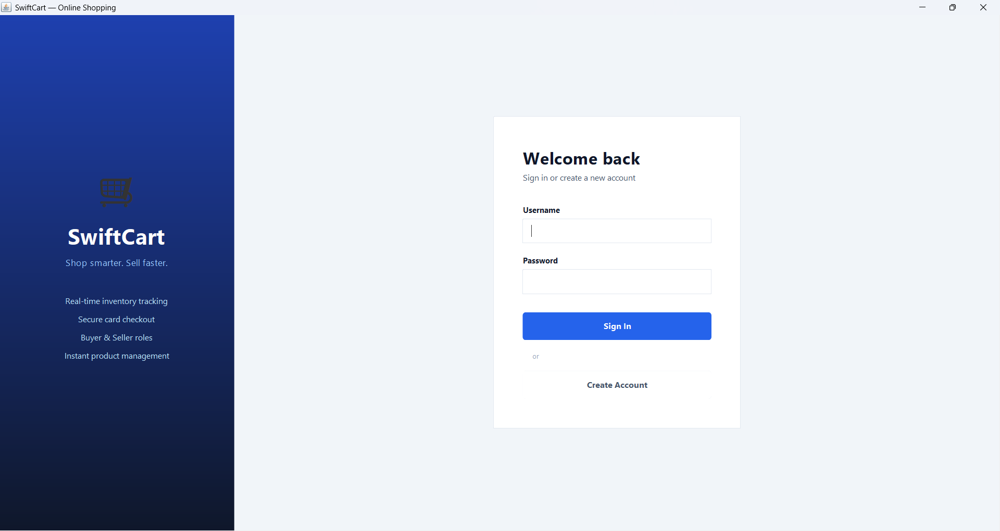
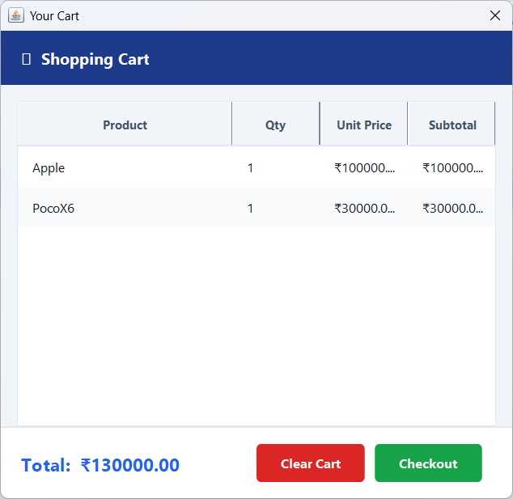
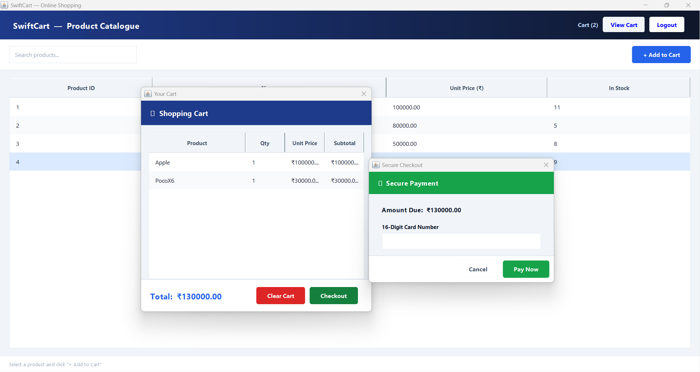
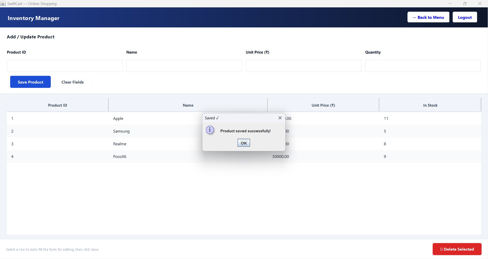

# 🛒 Online Shopping Cart System

## 📌 Description
A Java-based console application that simulates an online shopping cart.  
It allows users to add products, remove items, view cart, and checkout.

---

## 🚀 Features
- Add products to cart
- Remove products
- View cart
- Checkout system

---

## 🛠️ Technologies Used
- Java
- OOP Concepts
- File Handling

---

## 📂 Project Structure
online-shopping-cart/
   - ├── model/
   - ├── service/
   - ├── database/
   - ├── ui/
   - └── main/


---

## ▶️ How to Run

```bash
javac main/*.java model/*.java service/*.java database/*.java ui/*.java
java main.MainApp


## 📸 Screenshots

### 🔐 Login Page


### 🎭 Role Selection


### 🛒 Cart View


### 💳 Checkout


### 🧑‍💼 Seller Section



## ⭐ Project Highlights
- Modular architecture (model, service, database, ui)
- Separation of concerns
- Scalable design
- Real-world simulation of shopping system


## 🔮 Future Improvements
- GUI using JavaFX or Swing
- Database integration (MySQL)
- Online payment integration
- REST API (Spring Boot)


## 👨‍💻 Author
- Amit Kumar Naik
- Nitesh Rajbhar